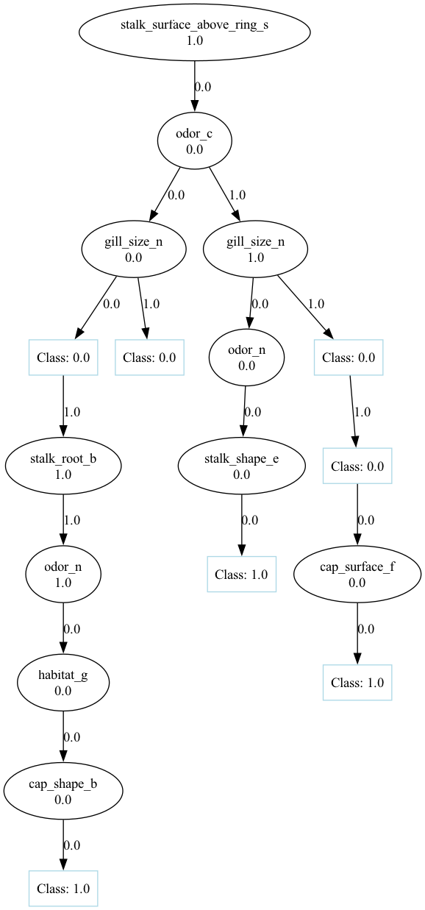

# ais-lab-5
Decision trees

`ru` **Задание**

1. Для студентов с четным порядковым номером в группе – датасет с [классификацией грибов](https://archive.ics.uci.edu/ml/datasets/Mushroom), а нечетным – [датасет с данными про оценки студентов инженерного и педагогического факультетов](https://archive.ics.uci.edu/dataset/856/higher+education+students+performance+evaluation) (для данного датасета нужно ввести метрику: студент успешный/неуспешный на основании грейда)
2. Отобрать **случайным** образом sqrt(n) признаков
3. Реализовать без использования сторонних библиотек построение дерева решений  (дерево не бинарное, numpy и pandas использовать можно, использовать список списков  для реализации  дерева - нельзя) для решения задачи бинарной классификации 
4. Провести оценку реализованного алгоритма с использованием Accuracy, precision и recall
5. Построить кривые AUC-ROC и AUC-PR (в пунктах 4 и 5 использовать библиотеки нельзя)

`eng` **Task**

1. For students with an even ordinal number in the group – dataset with [mushroom classification] (https://archive.ics.uci.edu/ml/datasets/Mushroom ), and the odd one is [dataset with data on the grades of engineering and pedagogical students факультетов](https://archive.ics.uci.edu/dataset/856/higher+education+students+performance+evaluation ) (for this dataset, you need to enter the metric: student successful/unsuccessful based on grade)
2. Select **randomly** sqrt(n) features
3. Implement the construction of a decision tree without using third-party libraries (the tree is not binary, numpy and pandas can be used, you can not use a list of lists to implement a tree) to solve the problem of binary classification 
4. Evaluate the implemented algorithm using Accuracy, precision and recall
5. Build AUC-ROC and AUC-PR curves (libraries cannot be used in paragraphs 4 and 5)

### Алгоритм Decision Tree

Занимаемся постройкой дерева решений для классификации данных, заходим в мир энтропии, чтобы выбрать топовый признак на каждом уровне. Дерево растет само по себе, пока не достигнет максимальной глубины или пока все данные не будут четко разделены.

### `build_tree`

Эта функция, по сути, создает наше дерево решений в виде вложенных словарей. У нас есть ключи — это признаки, а значения — узлы (листья или дочерние узлы).

1. Первым делом смотрим, какие у нас есть признаки, и считаем, как они влияют на энтропию. Берем тот признак, который круто уменьшает энтропию, чтобы разнести данные по разным направлениям.
2. Если мы еще не уперлись в `max_depth` и данные не полностью разделены, создаем новый узел с выбранным признаком. Разбиваем данные на подмножества по значению этого признака.
3. Запускаем функцию снова для каждого подмножества данных, пока не упремся в максимальную глубину или пока в подмножестве не останется только один класс.

### `predict`

Теперь мы предсказываем класс для нового образца, используя наше уже собранное дерево. `predict` вернет предсказанный класс для данного образца.

1. Начинаем с корневого узла дерева и сравниваем значение признака образца с тем, что есть в узле.
2. Если значение совпадает с условием в узле, переходим к нужному дочернему узлу. Если узел — это лист (нет дочерних узлов), возвращаем класс, который связан с этим узлом.
3. Продолжаем двигаться по узлам дерева, пока не дойдем до листа, где и выясняется, какой класс мы предсказываем.

